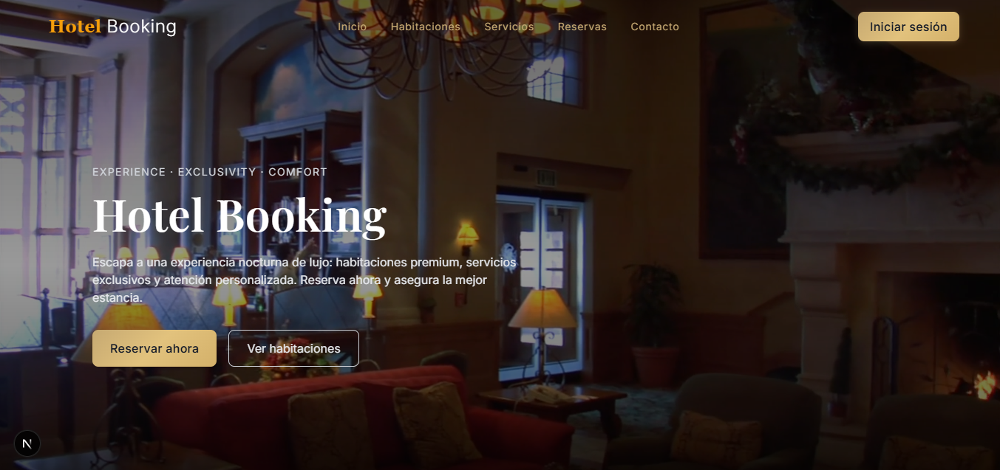
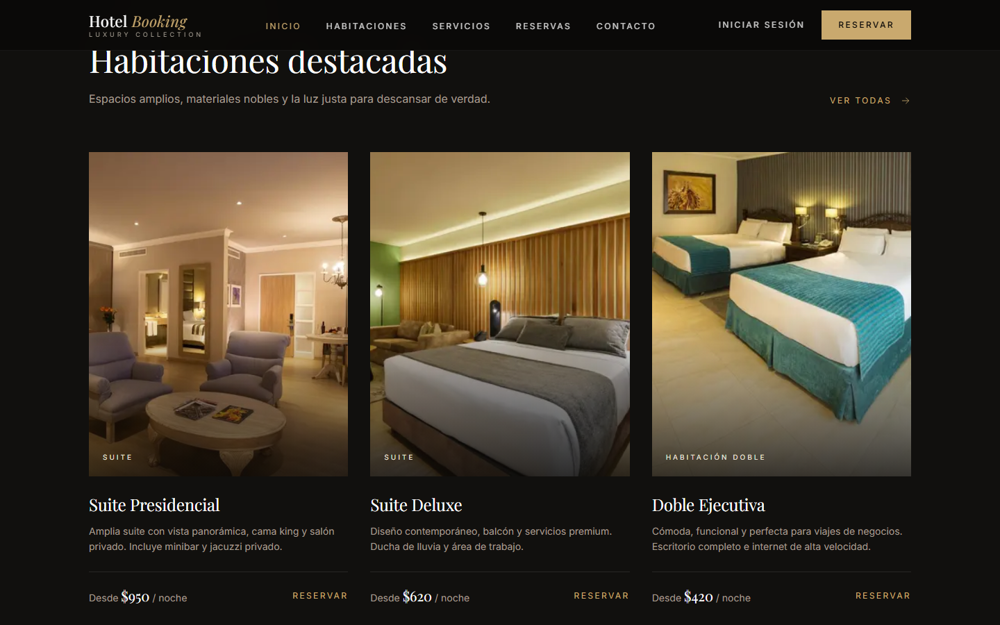
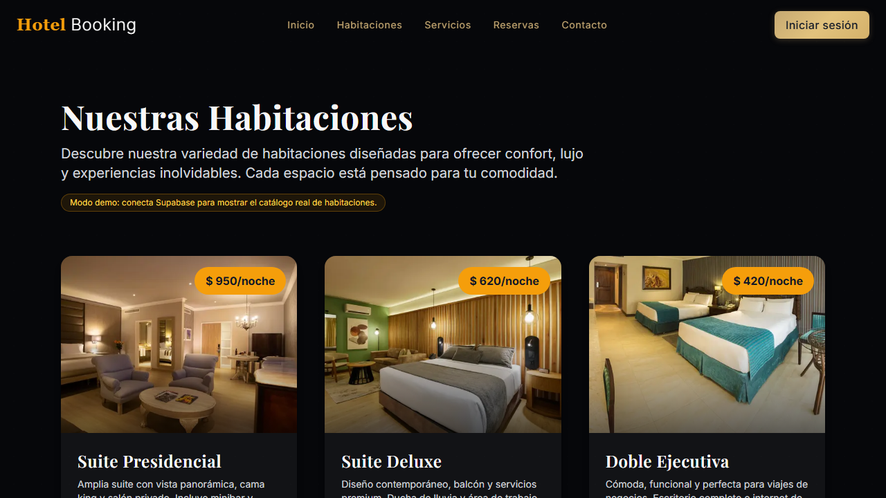
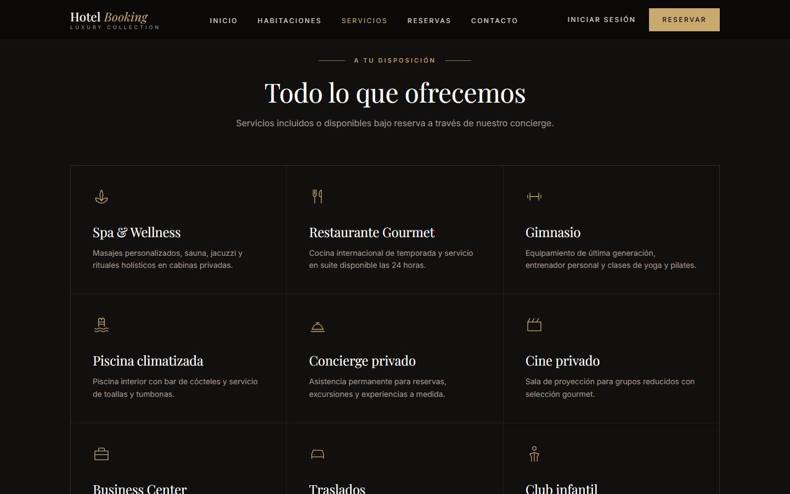
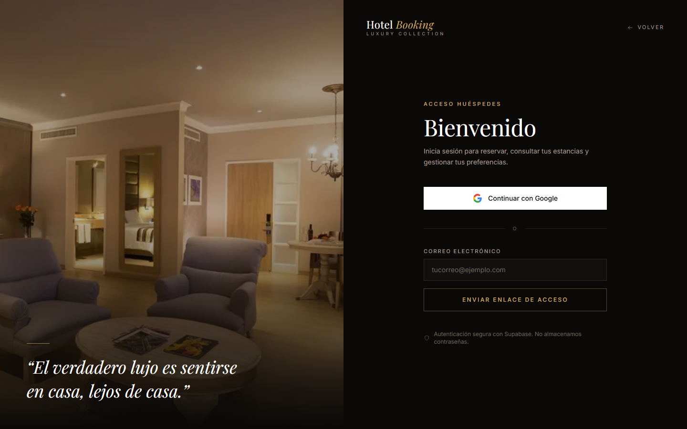
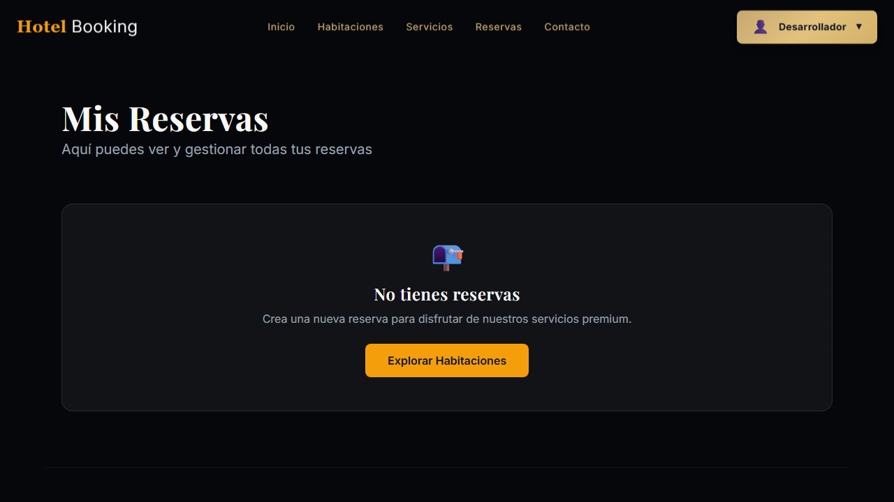
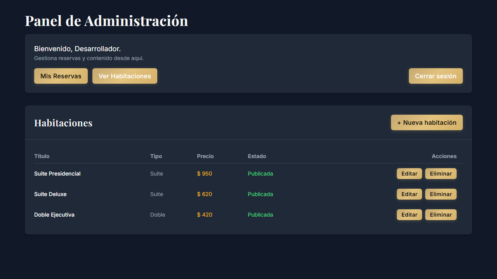
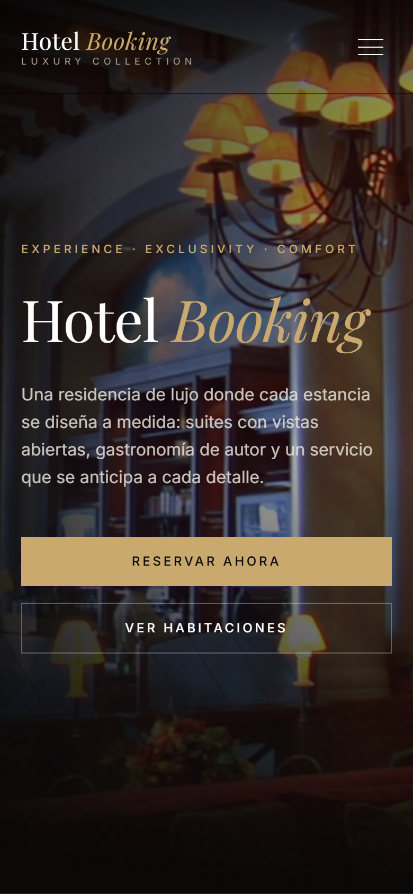
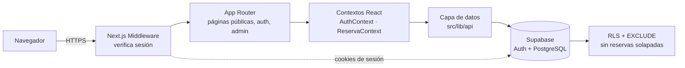

<div align="center">

# Hotel Booking

**Plataforma full-stack de reservas para un hotel de lujo**

Next.js 16 · React 19 · TypeScript · Supabase · Tailwind CSS

[**Ver demo**](https://hotel-booking-gamma-red.vercel.app) · [Portafolio](https://portafolio-ng-gamma.vercel.app) · [Arquitectura](#arquitectura) · [Ejecutar en local](#ejecutar-en-local)

[](https://github.com/Dev-Sot/hotel-booking/actions/workflows/ci.yml)
[](https://hotel-booking-gamma-red.vercel.app)
[](https://nextjs.org/)
[](https://www.typescriptlang.org/)
[](https://supabase.com/)
[](LICENSE)

<br />



</div>

---

## Descripción

Muchos hoteles gestionan sus reservas por teléfono o en hojas de cálculo, y eso se traduce en dobles reservas, errores manuales y ninguna opción de autoservicio para el huésped.

**Hotel Booking** es una aplicación web donde el huésped se autentica, explora el catálogo y reserva en tiempo real, mientras el hotel administra sus habitaciones desde un panel propio. La disponibilidad se garantiza **a nivel de base de datos**, no solo en el frontend.

Es un proyecto de portafolio full-stack que cubre autenticación real, autorización por roles, seguridad a nivel de fila (RLS), tests automatizados, CI y despliegue continuo, además de la interfaz.

## Características

| Área | Qué incluye |
|---|---|
| **Autenticación** | Google OAuth y magic link con Supabase Auth; sesión en cookies (`@supabase/ssr`) |
| **Autorización** | Rutas `/admin` y `/reservas` protegidas en el servidor mediante middleware; rol `admin` en la tabla `profiles` |
| **Reservas** | Validación de fechas en cliente y restricción `EXCLUDE` en Postgres contra reservas solapadas |
| **Catálogo** | Habitaciones dinámicas desde Supabase con imágenes optimizadas (`next/image`) |
| **Administración** | CRUD de habitaciones, métricas del catálogo y publicación/ocultación de habitaciones |
| **Interfaz** | Diseño editorial oscuro, responsive, animaciones sutiles con Framer Motion e iconografía SVG propia |
| **Calidad** | Tests unitarios (Vitest + Testing Library), e2e (Playwright), ESLint y `tsc` en CI |
| **Modo demo** | Sin backend configurado, la app sigue siendo navegable con datos de ejemplo claramente señalados |

## Capturas

<table>
  <tr>
    <td width="50%"><br /><sub><b>Inicio</b> · habitaciones destacadas</sub></td>
    <td width="50%"><br /><sub><b>Habitaciones</b> · catálogo con detalle y tarifa</sub></td>
  </tr>
  <tr>
    <td><br /><sub><b>Servicios</b></sub></td>
    <td><br /><sub><b>Acceso</b> · Google OAuth y magic link</sub></td>
  </tr>
  <tr>
    <td><br /><sub><b>Mis reservas</b> · ruta protegida</sub></td>
    <td><br /><sub><b>Panel de administración</b> · CRUD por rol</sub></td>
  </tr>
</table>

<p align="center">
  <br />
  <sub>Vista móvil</sub>
</p>

## Stack

| Capa | Tecnologías |
|---|---|
| Frontend | Next.js 16 (App Router, Turbopack, React Compiler), React 19, TypeScript, Tailwind CSS, Framer Motion |
| Backend | Next.js Middleware, Route Handlers, Supabase Auth |
| Base de datos | Supabase (PostgreSQL), Row Level Security, restricciones `EXCLUDE` / `CHECK` |
| Testing | Vitest, Testing Library, Playwright |
| DevOps | GitHub Actions (lint, typecheck, tests, build, e2e), Vercel |

## Arquitectura



**Flujo de una reserva**

1. El middleware valida la cookie de sesión de Supabase antes de renderizar rutas protegidas.
2. `ReservaForm` valida nombre y rango de fechas en el cliente para dar feedback inmediato.
3. `lib/api/reservas.ts` inserta la reserva; RLS asegura que cada usuario solo escriba las suyas.
4. La restricción `EXCLUDE` de Postgres rechaza cualquier solapamiento, incluso con peticiones concurrentes.

**Decisiones técnicas**

- **Sesión en cookies, no en `localStorage`**: así el middleware puede verificarla en el servidor antes de enviar HTML protegido.
- **Doble validación de disponibilidad**: en la aplicación (mensajes claros) y en la base de datos (a prueba de condiciones de carrera).
- **Degradación honesta**: sin Supabase configurado, la app muestra datos de ejemplo marcados como demo; nunca simula una sesión en producción.
- **Sistema de diseño propio**: tokens de color y tipografía en `tailwind.config.ts` y componentes (`btn-gold`, `field`, `eyebrow`) en `globals.css`.

### Estructura del proyecto

```
src/
├── app/
│   ├── (public)/          Inicio, Habitaciones, Servicios, Contacto, Reservas
│   ├── (auth)/login/      Acceso con Google y magic link
│   ├── (admin)/admin/     Panel de administración
│   ├── api/mock-auth/     Sesión simulada (solo modo demo local)
│   └── layout.tsx         Fuentes, metadatos SEO y providers
├── components/
│   ├── ui/                Button, Input, Modal, Icon
│   ├── shared/            Navbar, Footer, PageHero, SectionHeading, Reveal, AuthGuard
│   └── forms/             ReservaForm
├── context/               AuthContext, ReservaContext
├── lib/
│   ├── supabase/          Clientes browser, server (SSR) y middleware
│   ├── api/               auth, reservas, habitaciones, profile
│   ├── data/              Datos de ejemplo (modo demo)
│   └── utils/             validators, formatters, dateHelpers, constants
└── types/                 Modelos y props tipados
middleware.ts              Protección de /admin y /reservas
supabase/schema.sql        Esquema, políticas RLS y restricción anti doble reserva
tests/e2e/                 Tests de Playwright
```

## Ejecutar en local

**Requisitos:** Node.js 20 o superior y npm.

```bash
git clone https://github.com/Dev-Sot/hotel-booking.git
cd hotel-booking
npm install
cp .env.example .env.local
npm run dev
```

Abre [http://localhost:3000](http://localhost:3000). Sin credenciales de Supabase la app arranca en **modo demo** con el catálogo de ejemplo.

### Conectar Supabase (opcional)

1. Crea un proyecto en [supabase.com](https://supabase.com).
2. En **SQL Editor**, ejecuta [`supabase/schema.sql`](supabase/schema.sql).
3. Activa el proveedor **Google** en *Authentication → Providers*.
4. Completa `.env.local`:

```bash
NEXT_PUBLIC_SUPABASE_URL=https://xxxx.supabase.co
NEXT_PUBLIC_SUPABASE_ANON_KEY=eyJ...
NEXT_PUBLIC_APP_URL=http://localhost:3000

# Solo desarrollo local: simula una sesión sin backend. Nunca en producción.
NEXT_PUBLIC_USE_MOCK_AUTH=false
```

Para dar permisos de administrador, cambia `role` a `admin` en la fila del usuario en la tabla `profiles`. A propósito, no existe forma de hacerlo desde el cliente.

### Scripts

| Comando | Descripción |
|---|---|
| `npm run dev` | Servidor de desarrollo |
| `npm run build` | Build de producción |
| `npm run start` | Sirve el build de producción |
| `npm run lint` | ESLint |
| `npm run typecheck` | Comprobación de tipos con `tsc` |
| `npm run test` | Tests unitarios (Vitest) |
| `npm run test:e2e` | Tests end-to-end (Playwright) |

## Despliegue

La app se despliega en **Vercel** con cada push a `main`. Variables necesarias en el proyecto de Vercel: `NEXT_PUBLIC_SUPABASE_URL`, `NEXT_PUBLIC_SUPABASE_ANON_KEY` y `NEXT_PUBLIC_APP_URL`. Agrega el dominio de producción como *Redirect URL* en Supabase Auth.

## Roadmap

- [ ] Formulario de contacto conectado a un endpoint real
- [ ] React Hook Form + Zod para validación de formularios
- [ ] Subida de imágenes a Supabase Storage desde el panel
- [ ] Pasarela de pagos (Stripe) para confirmar reservas
- [ ] Internacionalización (ES / EN)
- [ ] Auditoría de accesibilidad con axe-core

## Autor

**Dev-Sot**. Desarrollador full-stack.

- Portafolio: [portafolio-ng-gamma.vercel.app](https://portafolio-ng-gamma.vercel.app)
- GitHub: [@Dev-Sot](https://github.com/Dev-Sot)
- Demo: [hotel-booking-gamma-red.vercel.app](https://hotel-booking-gamma-red.vercel.app)

## Licencia

Distribuido bajo la licencia MIT. Consulta [`LICENSE`](LICENSE).
